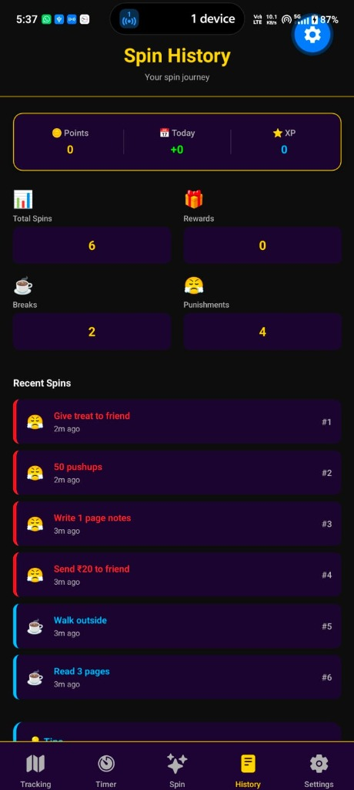

# INSTA - Gamified Productivity App

> "Instant attention. Instant action. Instant growth."

A React Native app built with Expo that gamifies productivity using spin wheels, focus timers, and a points system to fight procrastination and build discipline.

## 📱 Screenshots

<p align="center">
  
  &nbsp;&nbsp;&nbsp;&nbsp;
  
</p>


## 🚀 Quick Start

### Prerequisites

- Node.js 18+
- npm or yarn
- Expo CLI (`npm install -g expo-cli`)
- Android Studio or Xcode (for building/running)

### Installation

1. Navigate to the project directory:

```bash
cd Insta
```

2. Install dependencies:

```bash
npm install
```

3. Start the development server:

```bash
npm run android
# or for iOS:
npm run ios
# or for Web:
npm run web
```

## 📱 Features

### Core Features

- **Focus Timer** - Customizable focus blocks (default 45 minutes)
- **Three Spin Wheels**:
  - 🎁 **Reward Wheel** - Spend earned points for rewards
  - ☕ **Break Wheel** - Free break activity suggestions
  - 😤 **Punishment Wheel** - For when you cheat (confess to earn points back)

- **Points System**:
  - Earn 1 point per completed focus block
  - Spend points on reward spins
  - Streak tracking with daily consistency
  - Lifetime XP never decreases

- **Gamification**:
  - Current points always visible
  - Daily earned points reset at midnight
  - Streak tracking (current and longest)
  - Spin history with timestamps

- **Customization**:
  - Adjustable timer duration (5-120 minutes)
  - Sound effects toggle
  - Haptic feedback toggle
  - Daily spin limits

## 🎮 How It Works

### The Core Loop

1. **Start a Focus Block** → Complete 45-minute focused work
2. **Earn Points** → Get 1 point for each completed block
3. **Spin Wheels** → Spend points on the reward wheel
4. **Build Streaks** → Complete blocks daily to build streak
5. **Face Consequences** → If you cheat, spin the punishment wheel

### Points System

| Action               | Points                 |
| -------------------- | ---------------------- |
| Complete focus block | +1 point               |
| Spin reward wheel    | -1 point               |
| Cheat (confess)      | -2 points + punishment |
| Pause during block   | No points earned       |

### Wheels

**🎁 Reward Wheel** (Costs 1 point)

- Watch YouTube video
- Eat a snack
- 10-minute nap
- Call a friend
- Mystery reward (rare!)

**☕ Break Wheel** (Free)

- Call mom
- Read 3 pages
- Write random story
- Walk outside
- Stretch 5 minutes

**😤 Punishment Wheel** (Costs 2 points)

- 50 pushups
- Send ₹20 to friend
- Give treat to friend
- Write 1 page of notes
- No phone for 2 hours

## 🏗️ Project Structure

```
Insta/
├── app/                      # Expo Router screens
│   ├── _layout.tsx          # Root navigation
│   └── (tabs)/              # Bottom tab screens
│       ├── index.tsx        # Home dashboard
│       ├── timer.tsx        # Focus timer
│       ├── spin.tsx         # Spin wheels
│       ├── history.tsx      # Spin history
│       └── settings.tsx     # App settings
│
├── components/              # Reusable UI components
│   ├── Button.tsx
│   ├── PointsBar.tsx
│   ├── TimerRing.tsx
│   ├── StreakBadge.tsx
│   ├── SpinWheel.tsx
│   ├── WheelSelector.tsx
│   └── ProgressBar.tsx
│
├── hooks/                   # Custom React hooks
│   ├── usePoints.ts        # Points state management
│   ├── useTimer.ts         # Timer logic
│   └── useWheel.ts         # Spin wheel logic
│
├── logic/                   # Pure business logic (no React)
│   ├── timerLogic.ts       # Timer calculations
│   ├── pointsLogic.ts      # Points math
│   ├── spinLogic.ts        # Weighted spin outcomes
│   └── cheatLogic.ts       # Cheat detection
│
├── storage/                 # Data persistence
│   └── store.ts            # AsyncStorage wrapper
│
├── constants/               # App configuration
│   ├── colors.ts           # Color palette
│   └── wheelData.ts        # Default wheel items
│
├── types/                   # TypeScript definitions
│   └── index.ts
│
├── utils/                   # Utilities
│   ├── haptics.ts          # Haptic feedback
│   └── audio.ts            # Sound effects
│
└── assets/                  # Images and icons
```

## 🎨 Design System

### Colors

- **Primary Purple**: `#1a0533`
- **Gold Accent**: `#FFD700`
- **Neon Green**: `#39FF14` (success)
- **Alert Red**: `#FF3B30` (danger)
- **Dark Background**: `#0D0D0D`

### Typography

- **Headers**: 28-32px, bold, Gold
- **Labels**: 12-14px, medium, Gray
- **Body**: 12-14px, normal, Off-white

## 🔐 Data Persistence

All data is stored locally on device using AsyncStorage:

- Points (current, daily, lifetime XP)
- Streak (current, longest)
- Timer stats (blocks today, total blocks)
- Spin history (last 100 spins)
- User settings and preferences
- Wheel customizations (if added)

**Note**: Data is NOT synced to cloud. Clearing app data will reset everything.

## 📊 Key Hooks

### usePoints()

Manages points state and operations.

```typescript
const { points, earn, spend, deductForCheat, hasEnough, loading } = usePoints();

// Points object
{
  current: number; // Spendable now
  todayEarned: number; // Reset daily
  totalXP: number; // Never decreases
}
```

### useTimer(durationMinutes)

Controls focus timer state and progress.

```typescript
const {
  status, // 'idle' | 'running' | 'paused' | 'completed'
  remainingSeconds,
  progress, // 0-1
  formattedTime, // "45:00"
  start,
  pause,
  resume,
  complete,
  reset,
} = useTimer(45);
```

### useWheel()

Manages spin wheel outcomes and history.

```typescript
const { wheels, isSpinning, spinResult, spin, clearResult } = useWheel();

// Spin a wheel
const result = await spin("reward");
```

## 🔌 Tech Stack

| Tool                    | Version | Purpose              |
| ----------------------- | ------- | -------------------- |
| React Native            | 0.83.4  | Mobile framework     |
| Expo                    | ~55.0.9 | Development platform |
| Expo Router             | ~55.0.8 | File-based routing   |
| TypeScript              | ~5.9.2  | Type safety          |
| React Native Reanimated | 4.2.1   | Smooth animations    |
| Expo Haptics            | ~55.0.9 | Vibration feedback   |
| React Navigation        | ^7.4.0  | Tab navigation       |
| AsyncStorage            | ^1.23.1 | Local persistence    |

## 🎯 MVP Completed

- ✅ Navigation setup (bottom tabs)
- ✅ Color and wheel constants
- ✅ AsyncStorage data layer
- ✅ Custom hooks (usePoints, useTimer, useWheel)
- ✅ Reusable components (Button, PointsBar, TimerRing, etc.)
- ✅ Spin logic with weighted probability
- ✅ All 5 screens (Home, Timer, Spin, History, Settings)
- ✅ Haptic feedback integration
- ✅ Data persistence and streak tracking

## 🚪 Future Enhancements

- [ ] Sound effects for spins and rewards
- [ ] App lock during focus time (prevents switching apps)
- [ ] Progress graphs and statistics dashboard
- [ ] Level system (XP thresholds → levels)
- [ ] Achievement badges
- [ ] Social features (share streaks, leaderboards)
- [ ] Cloud backup and sync
- [ ] Dark/Light theme toggle
- [ ] Pomodoro preset (25-5)
- [ ] Custom rewards editor (add/remove items)

## 🐛 Debugging

Check TypeScript errors:

```bash
npx tsc --noEmit
```

Clear Metro bundler cache:

```bash
npx expo start --clear
```

View logs:

```bash
npx expo start --verbose
```

## 📝 Philosophy

**INSTA Philosophy**

| Principle             | Meaning                                   |
| --------------------- | ----------------------------------------- |
| Earn before you enjoy | Complete focus blocks to earn spin points |
| Guilt as a tool       | Punishment wheel creates accountability   |
| Randomness = dopamine | Unpredictable spins keep you engaged      |
| Growth feels fun      | UI gamifies productivity                  |
| Honest by design      | Cheat button - honesty built in           |

## 📧 Support

For issues or questions about the app, review the `details.md` file which contains comprehensive developer guidelines and specifications.

## 📄 License

This is a personal project.

---

**Built with ❤️ using React Native and Expo** 🚀
